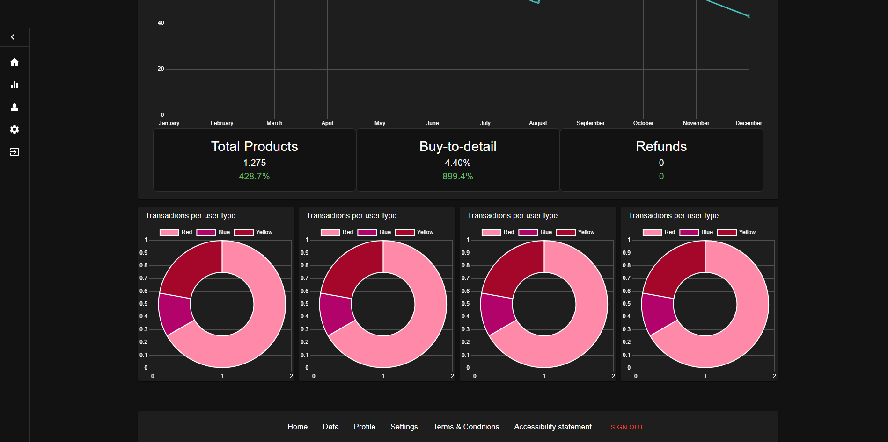

# Dashboard App with Next.js

This is a Next.js application that serves as a dashboard to display data (dump data). It includes authentication using Google (implemented with NextAuth), data charts generated using React Charts, Material UI for designing, a Material UI data table for the Data interface, and additional pages for profile and settings.

## Getting Started

These instructions will help you set up and run the project on your local machine.

### Prerequisites

Make sure you have Node.js and npm installed on your machine.

### Installation

1. Clone the repository:

```bash
git clone https://github.com/Achraf-haddar/Dashboard-Web-App.git
```

2. Install dependencies:

```bash
cd Dashboard-Web-App
npm install
```

3. Set up environment variables:

   Create a .env.local file in the root of the project and add your TMDB API key and OpenAI API key (you can follow .env.local.example):

```bash
GOOGLE_ID=your-google-client-id
GOOGLE_SECRET=your-google-client-secret
NEXTAUTH_SECRET=your-nextauth-secret
```

4. Run the application:

```bash
npm run dev
```

5. Open the application:

   You can access the application in the browser via http://localhost:3000

## Technologies Used

- Next.js (TypeScript)
- NextAuth.js
- React.js
- React Charts
- Material UI

## Screenshots:





